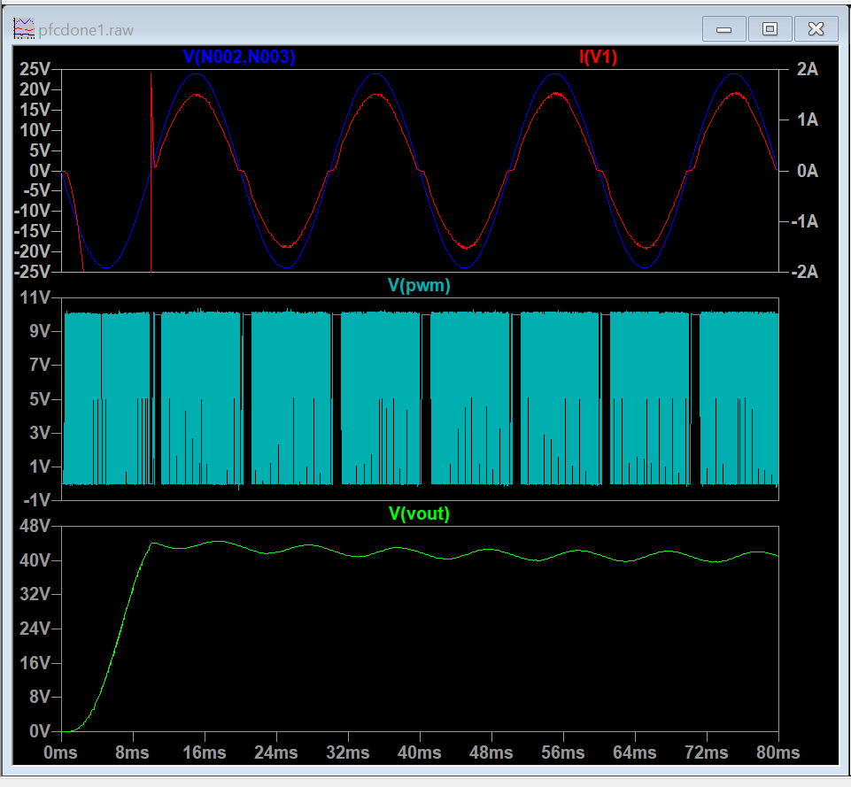

# Power Factor Correction (PFC)

## Overview

This folder contains the Power Factor Correction (PFC) circuit design and simulation work carried out during my Power Electronics internship.

The circuit was designed and simulated using **LTspice** to study PFC operation, switching behavior, input current characteristics, and output voltage regulation.

## Work Performed

- Studied the operating principle of a PFC circuit
- Designed and implemented the PFC circuit in LTspice
- Studied the relationship between input voltage and converter operation
- Analyzed the input current and output voltage waveforms
- Studied inductor current behavior
- Worked on output voltage regulation
- Investigated switching behavior and simulation stability
- Analyzed the effect of control parameters on converter performance

## Software Used

- **LTspice**

## Files

| File | Description |
|---|---|
| `PFC.asc` | LTspice schematic and simulation file |
| `pfc.png` | Simulation output waveform |

> **Note:** If your actual LTspice or image filenames are different, replace the filenames above with the exact names in the folder.

## Simulation Result

The simulation output obtained from LTspice is shown below.

## Key Concepts

- Power Factor Correction
- AC-DC power conversion
- Rectified AC input
- Inductor current
- Switching operation
- PWM control
- Output voltage regulation
- Continuous Conduction Mode (CCM)
- Input current shaping

## Learning Outcome

This work provided practical experience in designing and simulating a PFC circuit and helped develop an understanding of input current shaping, switching behavior, inductor current, and output voltage regulation in power conversion systems.
