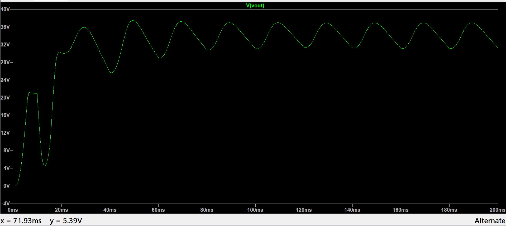

# Totem-Pole PFC

## Overview

This folder contains the design and simulation work carried out for a **Totem-Pole Power Factor Correction (PFC)** topology during my Power Electronics internship.

The circuit was implemented and analyzed using **LTspice** to study the switching operation, power-conversion behavior, and practical challenges associated with the Totem-Pole PFC topology.

## Work Performed

- Studied the operating principle of Totem-Pole PFC
- Analyzed the high-frequency and low-frequency switching paths
- Implemented the Totem-Pole PFC topology in LTspice
- Studied switching behavior during different portions of the AC cycle
- Analyzed input and output waveforms
- Investigated switching transitions around the AC zero crossing
- Studied the effect of gate-drive and switching parameters
- Investigated practical switching challenges and simulation behavior

## Software Used

- **LTspice**

## Files

| File | Description |
|---|---|
| `totempfc.asc` | LTspice schematic and simulation file |
| `totem_pfc.png` | Simulation output waveform |

> **Note:** If your actual LTspice or image filenames are different, replace the filenames above with the exact names in the folder.

## Simulation Result

The simulation output obtained from LTspice is shown below.

## Key Concepts

- Totem-Pole PFC topology
- Power factor correction
- High-frequency switching
- Low-frequency switching
- AC zero-crossing
- Gate-drive requirements
- Switching transitions
- GaN power devices
- Reverse-recovery considerations
- High-efficiency power conversion

## Learning Outcome

This work provided practical understanding of the Totem-Pole PFC topology and its switching behavior. It also provided hands-on experience with LTspice simulation and helped develop an understanding of the challenges associated with high-frequency switching and AC zero-crossing transitions.
